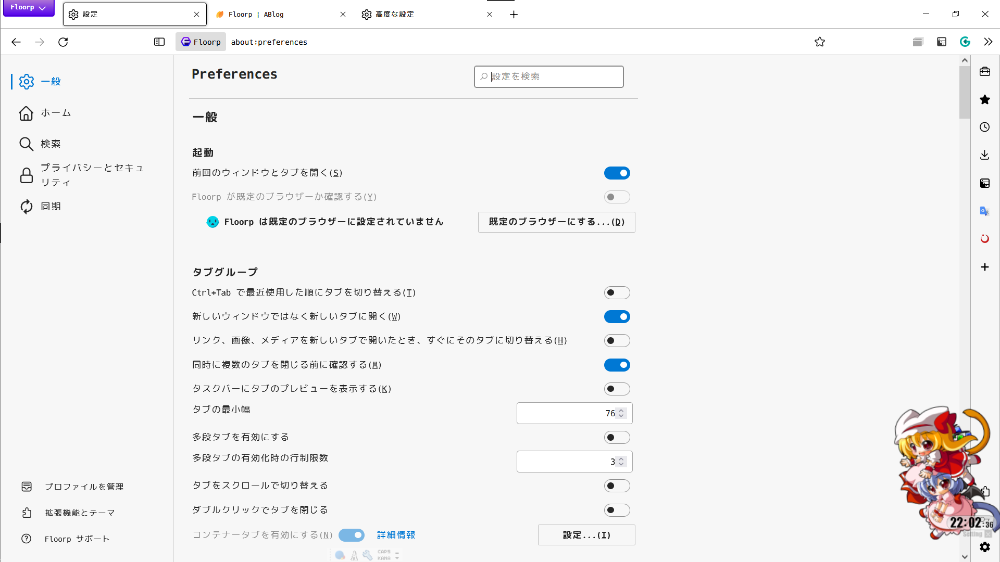
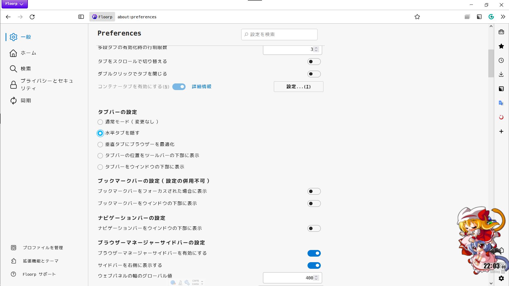
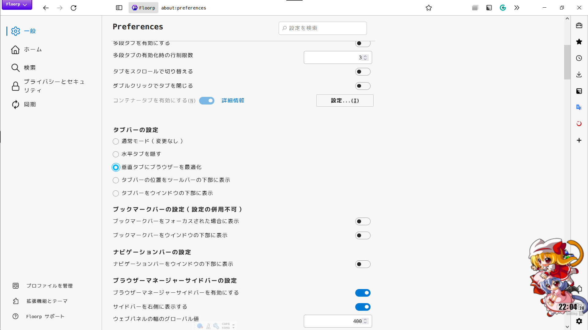
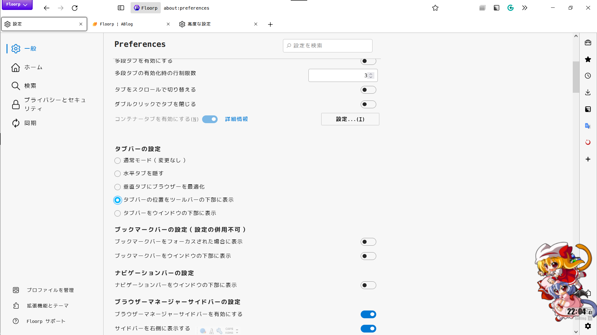
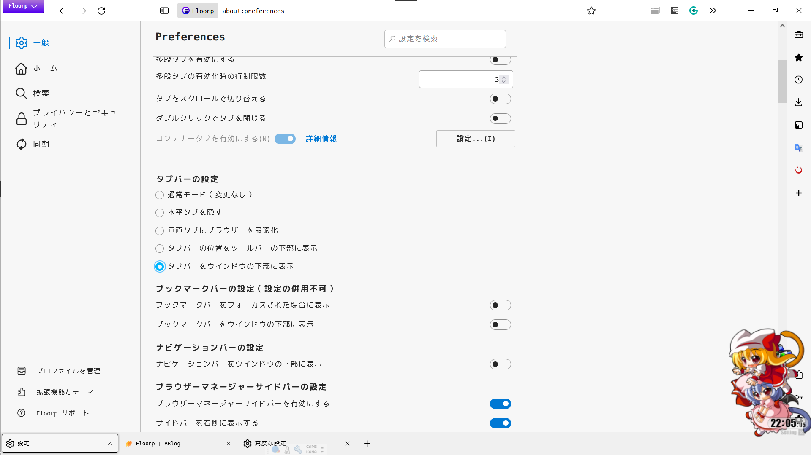

# Classic Floorp Menu Button
昔Floorpに存在していた、メニューボタンを昔ながらにする設定を、テーマとして復活させました。  
※ デュアルテーマ 及び Stylesheetで本気を出させること の使用しか想定していません。それが厳しいなら改造してください。  
[デュアルテーマの使い方](https://blog.ablaze.one/2449/2022-10-10/)  
## デザイン
タブバーの設定が「通常モード（変更なし）」「水平タブを隠す」「垂直タブにブラウザーを最適化 でかつ メニューバーを表示」  
→ `classic_floorp_menu_button.xpi`  
 
 
 
タブバーの設定が「垂直タブにブラウザーを最適化 でかつ メニューバーを非表示」「タブバーの位置をツールバーの下部に表示」「タブバーをウインドウの下部に表示」  
→ `classic_floorp_menu_button_in_navbar.xpi`  
 
 
 